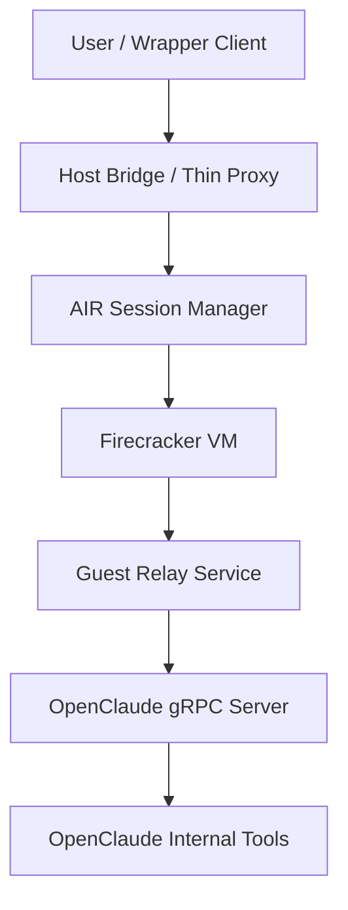
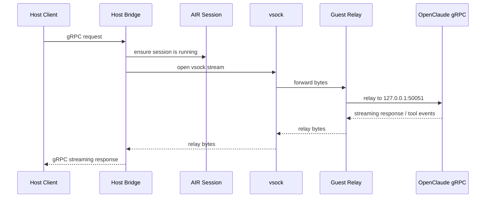
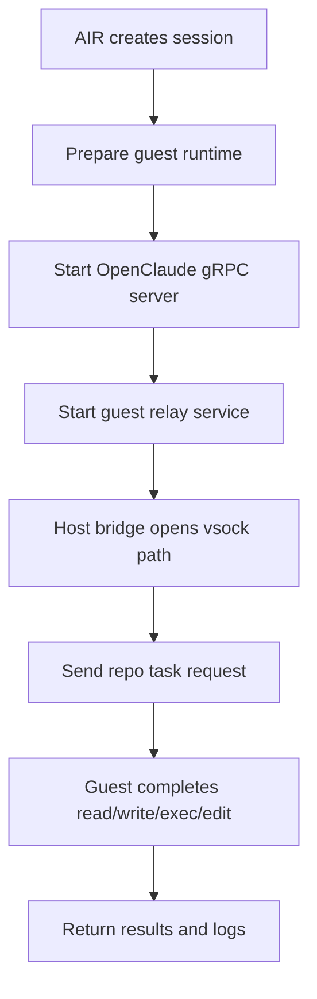

# OpenClaude Integration With AIR

[中文](openclaude-integration.md)

This document describes how to integrate OpenClaude with AIR while avoiding source changes to `openclaude` as much as possible.

## 1. Goal

The goal is not to add one optional AIR tool to OpenClaude. The goal is to run as much of OpenClaude's actual workflow as possible inside AIR's isolation boundary.

Constraints:

- avoid modifying `~/Documents/code/openclaude`
- avoid invasive changes to OpenClaude's internal tool system
- reuse OpenClaude's existing headless / gRPC mode first
- reuse AIR's existing `session create / exec / delete` path first

## 2. Conclusion First

The most practical zero-intrusion path is not a plugin that replaces OpenClaude's internal Bash/File tools. It is:

- run the entire OpenClaude process inside an AIR session / VM
- prefer the OpenClaude gRPC server over the interactive TUI
- keep only a thin host-side client or proxy outside AIR

Architecture:



This matters because:

- BashTool runs in the guest
- FileRead / FileWrite / FileEdit run in the guest
- Grep / Glob / Git and other local tools also run in the guest
- there is no need to replace OpenClaude's built-in tools one by one

## 3. Why A Plugin Is Not Enough

OpenClaude includes direct local filesystem tools, not just shell execution, including:

- `FileReadTool`
- `FileWriteTool`
- `FileEditTool`
- `GlobTool`
- `GrepTool`

If you only add an MCP tool or wrapper such as `air_exec`, two problems remain:

- the model may still choose the original local tools
- filesystem access may still bypass AIR and hit the host directly

That makes plugin-based integration a soft integration path, not a strong isolation path.

## 4. Why gRPC Is The Right First Path

OpenClaude already exposes a headless gRPC server through:

- `scripts/start-grpc.ts`
- `src/grpc/server.ts`
- `src/proto/openclaude.proto`
- `scripts/grpc-cli.ts`

That means OpenClaude can run as an agent service instead of requiring an attached interactive TUI.

For AIR, gRPC is a better first integration path because:

- TTY attach is not AIR's strongest path today
- gRPC is easier to start, supervise, restart, and observe through AIR sessions
- permission prompts, logs, and lifecycle are easier to standardize

### 4.1 Communication Flow



## 5. Recommended Rollout

### Phase A: Zero-intrusion PoC

Goal: run OpenClaude inside AIR without modifying OpenClaude source.

Steps:

1. AIR creates a session
2. the session prepares Node/Bun and OpenClaude runtime dependencies
3. OpenClaude gRPC server is started inside the session
4. the host uses a thin client that forwards requests into the guest
5. validate a real repo task: read files, execute commands, modify files, return results

This phase is about proving the path works, not polishing packaging.



### Phase B: AIR sidecar / launcher

Goal: make the PoC repeatable and operationally consistent.

Possible shape:

```bash
air agent openclaude start
air agent openclaude stop
air agent openclaude status
```

That implies a standard startup command, health check, log location, port handling, and cleanup behavior.

### Phase C: Productized bridge

Goal: make host-side usage smooth.

This would add an AIR-aware bridge that:

- forwards user requests to the OpenClaude server inside a session
- tracks session lifecycle
- supports reconnect / replay / policy controls when needed

## 5.1 Capability Impact Matrix

Running OpenClaude inside AIR does not cause random degradation. It causes deliberate permission shrinkage.

### Core capabilities that should be preserved

- repo workspace read/write
- bash execution
- test execution
- basic Git operations
- task logs and result inspection

If these are not preserved, the AIR integration is not useful.

### Host-level capabilities that should shrink

- direct access to arbitrary host paths
- direct reuse of host shell state
- direct control of host GUI, browser, clipboard, or IDE integrations
- direct access to host daemons, sockets, SSH agent, or keychain
- unrestricted network access by default

This reduction is part of the value of AIR, not a failure of the integration.

### Capabilities that can be added back selectively

- whitelist networking
- explicit directory mounts or workspace injection
- explicit credential injection
- explicit MCP / gRPC bridges
- explicit IDE / LSP sidecars

The right question is not “did capabilities decrease.” The right questions are:

- did we preserve the core repo-task loop for the coding agent
- did we remove host privileges that should not be granted by default
- can we add back only the specific capabilities that are truly required

### Current conclusion

After moving OpenClaude into AIR:

- repo-task ability should remain largely intact
- host-level privilege should shrink significantly
- any stronger capability should be restored through explicit bridges or whitelists, not by reopening direct host access

## 6. What AIR Still Needs

### 6.1 Long-running process support

AIR is strongest today at command-style `exec`, but the OpenClaude gRPC server is a long-lived service process.

AIR needs to confirm or extend:

- background service launch
- liveness detection
- stop / cleanup behavior
- session state when the service crashes

### 6.2 Host <-> guest communication path

If the OpenClaude gRPC server listens inside the guest, the host needs a supported transport path.

Options include:

- Firecracker `vsock`
- port forwarding
- a host-side proxy process
- or a relay protocol through `air-agent`

The best first direction is likely a host/guest relay built on top of the existing `air-agent` path, rather than exposing general guest networking.


### 6.3 Workspace preparation

OpenClaude directly operates on a working directory, so the guest must have the repo workspace available.

Possible first-pass options:

- package the host repo and inject it into the guest workspace
- clone inside the guest
- later add formal workspace sync to AIR

The first recommendation is simple:

- inject the repo into the guest workspace
- pull back diff / patch / artifacts afterward

## 7. What Not To Do First

These should not be the main first implementation path:

- only add an MCP `air_exec` tool to OpenClaude
- only move BashTool to AIR while file tools still hit the host
- make interactive TUI attach the first integration path
- build full bidirectional workspace sync and multi-tenant scheduling immediately

These are either incomplete from an isolation perspective or too expensive for a first pass.

## 8. First-pass Acceptance Criteria

A successful zero-intrusion PoC should prove:

- OpenClaude server runs inside an AIR session / VM
- it can complete at least one real repo task
- bash / file read / file write / file edit all occur in the guest
- the host receives final results and logs
- deleting the AIR session also cleans up the guest process and workspace

## 9. Recommended Next Steps

Recommended order:

1. validate long-running service behavior in AIR
2. define a guest startup script for the OpenClaude gRPC server
3. define the minimal host <-> guest bridge
4. run a single-repo PoC
5. only then decide whether deeper code-level integration is needed

## 10. Current Recommendation

The best next step is not changing OpenClaude itself. It is:

- treat OpenClaude as an agent process managed by AIR
- first prove `OpenClaude gRPC Server in AIR`
- then decide whether deeper adapters are still necessary
