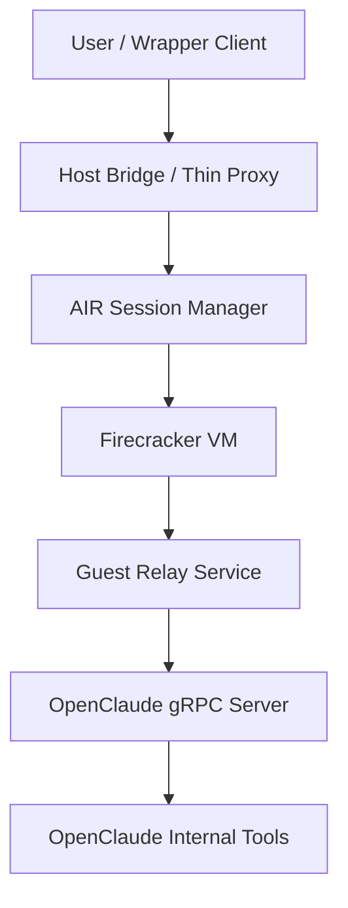
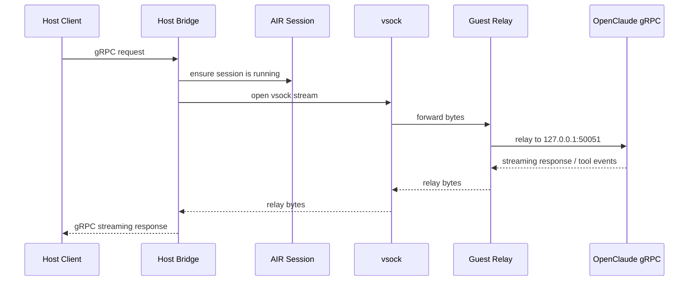
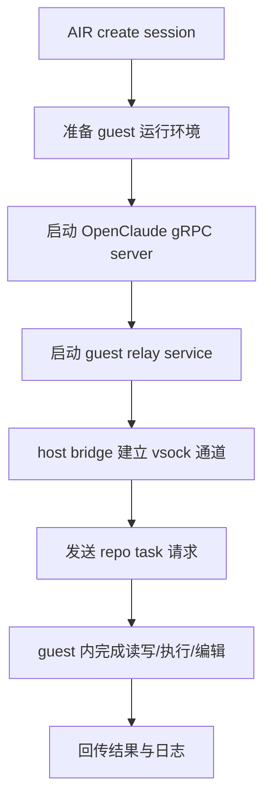

# OpenClaude 接入 AIR 方案

[English](openclaude-integration.en.md)

本文档描述如何在尽量不修改 `openclaude` 源码的前提下，把 OpenClaude 接到 AIR。

## 1. 目标

目标不是给 OpenClaude 简单增加一个可选工具，而是让它的实际工作流尽可能运行在 AIR 隔离环境中。

约束条件：

- 尽量不修改 `~/Documents/code/openclaude`
- 尽量不侵入 OpenClaude 内部工具系统
- 优先复用 OpenClaude 已有 headless / gRPC 入口
- 优先复用 AIR 已有 `session create / exec / delete` 能力

## 2. 先说结论

当前最可行的零侵入路径不是“插件替换 OpenClaude 的内置 Bash/File 工具”，而是：

- 把整个 OpenClaude 进程放进 AIR session / VM 里运行
- 优先运行 OpenClaude 的 gRPC server，而不是交互式 TUI
- 宿主机侧只保留一个很薄的 client / proxy

也就是：



这样做的核心价值是：

- BashTool 在 guest 里执行
- FileRead / FileWrite / FileEdit 在 guest 里读写
- Grep / Glob / Git 等工具也都在 guest 里运行
- 不需要逐个替换 OpenClaude 内置工具

## 3. 为什么插件方案不够

OpenClaude 不只有 shell 工具，还包含直接访问本地文件系统的内置工具，例如：

- `FileReadTool`
- `FileWriteTool`
- `FileEditTool`
- `GlobTool`
- `GrepTool`

如果只通过插件、MCP 或外部 wrapper 增加 `air_exec` 之类的新工具，会有两个问题：

- 模型仍可能继续选择原生本地工具
- 文件系统访问依旧可能绕过 AIR，直接命中宿主机

所以插件方案只能做“软接入”，不能保证“强隔离”。

## 4. 为什么选 gRPC 模式

OpenClaude 已提供 headless gRPC server：

- `scripts/start-grpc.ts`
- `src/grpc/server.ts`
- `src/proto/openclaude.proto`
- `scripts/grpc-cli.ts`

这意味着可以把 OpenClaude 当作一个独立 agent service 运行，而不是必须附着到它的交互式 TUI。

对 AIR 来说，gRPC 模式比 TUI 更适合首版集成，原因是：

- TTY attach / 交互控制台目前不是 AIR 的主路径
- gRPC 更容易通过 `session exec` 启动、监管、重启
- 也更容易把权限确认、日志和生命周期纳入 AIR 控制面

### 4.1 通信流程图



## 5. 推荐实现路径

### 阶段 A：零侵入 PoC

目标：不修改 OpenClaude 源码，先让它整体跑进 AIR。

做法：

1. AIR 创建 session
2. 在 session 中准备 Node/Bun 与 OpenClaude 运行依赖
3. 在 session 中启动 `openclaude` gRPC server
4. 宿主机侧提供一个薄 client，把请求转发给 guest 中的 OpenClaude
5. 验证一次完整 repo 任务：读文件、执行命令、修改文件、返回结果

这一阶段不要求产品化安装体验，只要求验证链路成立。



### 阶段 B：AIR sidecar / launcher

目标：把 PoC 变成可重复启动的标准入口。

做法：

- 在 AIR 增加 `openclaude` launcher 脚本或 helper
- 约定 guest 内启动命令、监听端口、工作目录
- 标准化日志、PID、端口探活和退出清理

形态上更像：

```bash
air agent openclaude start --repo ~/Documents/code/openclaude
air agent openclaude status <session-id>
air agent openclaude stop <session-id>
air agent openclaude forward <session-id> --listen 127.0.0.1:50052
```

当前 AIR 已实现这个第一版 launcher：

- 默认启动命令是 `bun run scripts/start-grpc.ts`
- 默认监听 `127.0.0.1:50051`
- 可通过 `--command` 覆盖启动命令，便于测试或适配 OpenClaude 版本差异
- 会在 session runtime 目录记录 `openclaude.json`
- 会在 OpenClaude repo 下记录 `.air/openclaude/<session-id>/server.pid` 和 `server.log`
- `air session delete <session-id>` 会先尝试停止托管的 OpenClaude 进程，再清理 session
- `air agent openclaude forward` 会在宿主机打开本地 TCP 端口，并转发到 session 内的 OpenClaude TCP endpoint
- `local` provider 下直接转发到本机 TCP；`firecracker` provider 下通过 `air-agent` 的 vsock proxy 子协议转发到 guest 内 TCP

示例：

```bash
status=$(air agent openclaude start \
  --provider local \
  --repo ~/Documents/code/openclaude)

session_id=$(printf "%s" "$status" | jq -r .session_id)

air agent openclaude forward "$session_id" --listen 127.0.0.1:50052
air agent openclaude status "$session_id"
air agent openclaude stop "$session_id"
```

前提：

- `--repo` 指向的 OpenClaude 目录已经完成 `bun install`
- 当前环境里已经准备好 OpenClaude 需要的 provider 变量
- 例如走 DeepSeek / OpenAI-compatible 路线时，需要先设置 `CLAUDE_CODE_USE_OPENAI=1`、`OPENAI_BASE_URL`、`OPENAI_MODEL`、`OPENAI_API_KEY`

如果目标是 Firecracker guest，而不是 `local` provider，当前推荐直接构建一个较新的 Alpine guest rootfs，而不是继续在官方 demo rootfs 上硬塞 Bun：

```bash
scripts/prepare-openclaude-alpine-rootfs.sh \
  assets/firecracker/openclaude-alpine-rootfs.ext4 \
  ~/Documents/code/openclaude
```

然后使用：

```bash
export AIR_FIRECRACKER_ROOTFS="$(pwd)/assets/firecracker/openclaude-alpine-rootfs.ext4"
export AIR_FIRECRACKER_BOOT_ARGS="console=ttyS0 reboot=k panic=1 pci=off init=/sbin/init"

air agent openclaude start \
  --provider firecracker \
  --guest-repo /opt/openclaude
```

其中：

- guest 内固定 OpenClaude 路径为 `/opt/openclaude`
- guest 内固定 Bun 路径为 `/usr/local/bin/bun`
- guest 内还会提供 `/usr/local/bin/openclaude-grpc`
- guest 通过 `/etc/inittab` 在启动时拉起 `air-agent`
- `firecracker` provider 下，如果没有显式指定 `--guest-repo`，AIR 默认会回落到 `/opt/openclaude`
- 如果确实要继续复用已有 ext4 rootfs，也可以使用 `scripts/prepare-openclaude-firecracker-rootfs.sh`，但这条路只适合底层用户态已经满足 Bun 运行要求的镜像

### 阶段 C：产品化桥接

目标：让宿主机侧调用更顺滑。

做法：

- 宿主机已经有基础 `air agent openclaude forward` TCP bridge
- 后续需要在这个 TCP bridge 上包装 OpenClaude-aware client / UX
- 将用户请求自动转给指定 session 内的 OpenClaude server
- 可选加入会话恢复、权限策略、日志回放

## 5.1 能力影响矩阵

把 OpenClaude 放进 AIR 后，能力不会随机退化，而是会发生“有意的权限收缩”。

### 会尽量保留的核心能力

- repo 工作区读写
- bash 命令执行
- 测试运行
- Git 基本操作
- 任务日志与结果回看

这些能力如果保不住，AIR 集成就没有意义。

### 会被主动收缩的宿主机能力

- 直接访问宿主机任意路径
- 直接复用宿主机 shell 状态
- 直接操作宿主机 GUI / 浏览器 / 剪贴板 / IDE
- 直接访问宿主机本地 daemon、socket、SSH agent、keychain
- 默认无限制网络访问

这些能力的下降本身就是 AIR 的价值所在。

### 可以按需补回的能力

- 白名单网络
- 指定目录挂载或 workspace 注入
- 指定凭证注入
- 指定 MCP / gRPC bridge
- 指定 IDE / LSP sidecar

因此，判断标准不应是“能力有没有减少”，而应是：

- 是否保住了 repo 内 coding agent 的核心闭环
- 是否主动砍掉了不该默认拥有的宿主机权限
- 是否能通过白名单机制逐步加回确有必要的能力

### 当前结论

将 OpenClaude 放入 AIR 后：

- repo 内任务能力原则上应当保住
- 宿主机级权限会显著收缩
- 若后续需要更强能力，应通过显式 bridge 或白名单回补，而不是重新放开宿主机直连

## 6. 对 AIR 当前能力的要求

要跑通第一版，需要 AIR 至少补齐或确认以下能力：

### 6.1 进程驻留

OpenClaude gRPC server 是长驻进程，因此 AIR 需要能托管后台服务。

当前状态：

- 已支持通过 `air agent openclaude start` 后台启动
- 已支持通过 pid 文件做基础存活探测
- 已支持通过 `air agent openclaude stop` 停止
- 已支持 session 删除时自动清理托管进程
- 已支持通过 `air agent openclaude forward` 从 host 访问 session 内 OpenClaude TCP endpoint
- 已支持通过 `AIR_FIRECRACKER_BOOT_ARGS` 覆盖 Firecracker kernel cmdline，便于适配不同 guest init

仍需补齐：

- 服务级 readiness 探测，而不是只看 pid
- 崩溃原因标准化
- Firecracker guest 的 provider 出网能力
- Firecracker guest 内真实 OpenClaude 进程验收

### 6.2 端口 / 通信出口

如果 OpenClaude gRPC server 在 guest 里监听端口，需要定义 host 如何访问：

- Firecracker `vsock`
- guest 侧端口转发
- host 侧代理进程
- 或者用 AIR guest agent 充当 RPC relay

这里推荐优先评估：

- `guest air-agent <-> host` 之间增加转发子协议
- 不直接暴露通用 guest 网络端口


### 6.3 workspace 准备

OpenClaude 会直接操作工作目录内的文件，因此 guest 必须有完整 repo 工作区。

当前可行路径：

- 宿主 repo 打包后注入 guest workspace
- 或在 guest 内 `git clone`
- 或者后续由 AIR 提供正式的 workspace sync 能力

第一版建议：

- 先做“宿主 repo -> guest workspace”单向注入
- 任务结束后再把 diff / patch / 工件拉回宿主

## 7. 不建议的第一版做法

以下方案不适合作为第一版主线：

- 只给 OpenClaude 增加一个 MCP `air_exec` 工具
- 只把 BashTool 改成走 AIR，文件工具仍直连宿主机
- 直接把交互式 TUI attach 到 AIR console 作为首版方案
- 一开始就做完整双向文件同步和多租户调度

这些方案要么隔离不完整，要么首版复杂度过高。

## 8. 第一版验收标准

第一阶段 launcher 已满足：

- AIR 能创建或复用 session
- AIR 能在 session 中启动一个 OpenClaude-compatible 长驻服务进程
- AIR 能查询 pid、日志路径、监听端口与运行状态
- AIR 能停止服务进程
- session 删除时能清理服务进程

后续完整 PoC 还必须满足：

- OpenClaude server 运行在 Firecracker guest 内
- 宿主机能通过 bridge 访问 guest 内的 OpenClaude gRPC server
- 能处理至少一个真实 repo 任务
- 任务中的 bash / file read / file write / file edit 都发生在 guest
- 宿主机能拿到最终结果和日志

## 9. 下一步实施建议

按优先级建议这样做：

1. 用 `air agent openclaude start --repo ~/Documents/code/openclaude` 在 local provider 验证 OpenClaude gRPC server
2. 把同样 launcher 跑到 Firecracker provider
3. 设计 host <-> guest 的最小 bridge
4. 先跑一个只含单 repo 的 PoC
5. 再决定是否把这条链路产品化成正式 `agent runtime`

## 10. 当前建议

当前最值得做的不是修改 OpenClaude 本体，而是：

- 把 OpenClaude 视为“要被 AIR 托管的 agent process”
- 先打通 `OpenClaude gRPC Server in AIR`
- 再决定是否需要更深的代码级适配
