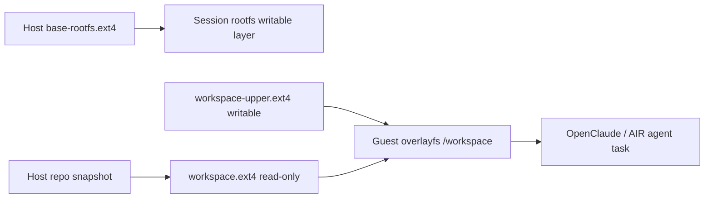

# Rootfs Management Architecture

[中文](rootfs-management-architecture.md)

This document defines how AIR should manage rootfs images, per-session writable state, workspace images, and guest overlayfs for the Firecracker backend.

## 1. Goals

Rootfs management must support:

- isolated writes for each VM session
- reusable, auditable, and distributable base runtime images
- host workspace injection into the guest
- guest-side changes without mutating the original host repo snapshot
- result export or session state cleanup after task completion

## 2. Current State

The current Firecracker runtime already uses a per-session root disk file:

- the host has a base `rootfs.ext4`
- session startup copies it into a session-private `rootfs.ext4`
- without a workspace, the session root disk is used as a writable root drive
- with a workspace, the session root disk is used as a read-only root drive

This is simple and clear from an isolation perspective. The downside is that copying the whole rootfs increases startup cost and disk usage.

## 3. Target Architecture

The long-term architecture should split storage into two independent paths:

- rootfs path: guest OS, AIR guest agent, OpenClaude/Bun, and stable runtime dependencies
- workspace path: user project repo, task input, and task output

Recommended model:



## 4. Rootfs Layer

### 4.1 Base rootfs

The base rootfs should only contain stable runtime assets:

- Linux userspace
- `/usr/bin/air-agent`
- Bun and base dependencies required by OpenClaude
- guest boot scripts
- diagnostic tools and a minimal shell environment

The base rootfs should not contain frequently changing user project code.

### 4.2 Session rootfs

Each session must have independent writable root disk state.

The first phase can keep the current implementation:

- copy the base rootfs into a session-private `rootfs.ext4` at startup
- without a workspace, use `rootfs.ext4` as a writable root drive
- with a workspace, use `rootfs.ext4` as a read-only root drive
- delete the session-private `rootfs.ext4` when the session is deleted

Future optimizations:

- keep the base rootfs read-only
- add a per-session block-level writable layer
- use snapshots, reflinks, or thin provisioning to reduce copy cost

Multiple VMs must not share the same writable rootfs because ext4 is not safe for concurrent writes by multiple guests.

## 5. Workspace Layer

The workspace layer makes the host repo available to the guest-side agent.

The recommended first version uses image mounting rather than direct host directory sharing:

- host builds a repo snapshot into `workspace.ext4`
- Firecracker attaches `workspace.ext4` as a second block device
- guest mounts it read-only at `/mnt/workspace-ro`
- guest mounts a session-private `workspace-upper.ext4`
- guest merges both with overlayfs at `/workspace`

## 6. Guest Overlayfs

Guest mount layout:

```text
/mnt/workspace-ro      read-only lowerdir, from workspace.ext4
/mnt/workspace-rw      writable upper disk, from workspace-upper.ext4
/mnt/workspace-rw/upper
/mnt/workspace-rw/work
/workspace             merged overlay view
```

Mount command shape:

```sh
mount -o ro /dev/vdb /mnt/workspace-ro
mount /dev/vdc /mnt/workspace-rw
mkdir -p /mnt/workspace-rw/upper /mnt/workspace-rw/work /workspace
mount -t overlay overlay \
  -o lowerdir=/mnt/workspace-ro,upperdir=/mnt/workspace-rw/upper,workdir=/mnt/workspace-rw/work \
  /workspace
```

Guest writes to `/workspace` only mutate `workspace-upper.ext4`.

Why this preserves `workspace.ext4`:

- `workspace.ext4` is mounted read-only
- overlayfs copies changed lower files into upperdir before modification
- deleting lower files creates whiteouts in upperdir
- `workdir` and `upperdir` live on the same writable filesystem

## 7. Host-Side Files

Each Firecracker session should eventually have this host-side layout:

```text
runtime/sessions/firecracker/<session-id>/
  rootfs.ext4
  workspace.ext4
  workspace-upper.ext4
  firecracker.sock
  firecracker.vsock
  console.log
  events.jsonl
  config/
    rootfs-drive.json
    workspace-drive.json
    workspace-upper-drive.json
```

Meaning:

- `rootfs.ext4` is the session-private root disk file
- `workspace.ext4` is a read-only snapshot of the host repo
- `workspace-upper.ext4` is the session workspace writable layer
- `config/*` records Firecracker drive configuration for diagnosis and replay

## 8. Lifecycle

### 8.1 Session creation

1. Parse `--workspace` or session workspace configuration
2. Build or reuse the base rootfs
3. Create the session root disk writable state
4. Build `workspace.ext4` from the host repo
5. Create an empty `workspace-upper.ext4`
6. Start Firecracker with root, workspace lower, and workspace upper drives
7. Guest boot scripts mount `/workspace`
8. Guest `air-agent` becomes ready for exec / proxy requests

### 8.2 Task execution

1. OpenClaude or AIR agent works inside `/workspace`
2. Reads primarily come from `workspace.ext4`
3. Writes go into `workspace-upper.ext4`
4. Logs remain in the session runtime directory and guest state files

### 8.3 Result export

Current status:

- the `/workspace` overlayfs mount has been validated in a real Firecracker guest
- the original host repo remains unchanged after guest writes
- `workspace-upper.ext4` now receives guest writes
- `air session export-workspace <id> <output-dir>` now exports the current merged `/workspace` view

Current first-version implementation:

- guest packages `/workspace`
- guest sends the archive back through the current exec/stdout path
- host extracts it into a requested output directory

A later version can optimize this into upperdir-only diff export.

### 8.4 Session deletion

On session deletion:

- stop Firecracker
- keep or delete the session-private `rootfs.ext4`
- keep or delete `workspace-upper.ext4`
- preserve exported workspace results according to user options

The default policy should be safe: never overwrite the original host repo automatically.

## 9. Drive Design

Firecracker needs at least three block devices:

- root drive: session root disk, writable
- workspace lower drive: repo snapshot, read-only
- workspace upper drive: session workspace writable layer, writable

The initial implementation can use fixed device ordering:

- `/dev/vda` root
- `/dev/vdb` workspace lower
- `/dev/vdc` workspace upper

A more robust later implementation should mount by label or UUID to avoid device ordering risk.

## 10. Image Build Strategy

Building `workspace.ext4` needs to handle:

- excluding `.git`, `.air`, and large cache directories
- excluding `node_modules` by default unless explicitly requested
- preserving symlinks, permissions, and executable bits
- estimating capacity and inode count
- recording source path, build time, exclude rules, and content digest

`workspace-upper.ext4` can start with a fixed initial size and gain resizing support later.

## 11. Security Boundary

This architecture guarantees by default:

- guest cannot directly write the host repo
- guest changes only enter session-private images
- different sessions have isolated rootfs and workspace writable layers
- host can review changes before exporting or applying them

It does not guarantee:

- malicious guest processes cannot consume disk space
- guest changes automatically sync back to host
- workspace images are encrypted by default

Those capabilities require quota, result review, encrypted images, or policy controls.

## 12. Implementation Order

Recommended sequence:

1. Support multiple Firecracker drives
2. Support building `workspace.ext4` from a host repo
3. Support creating `workspace-upper.ext4`
4. Mount overlayfs at `/workspace` in the guest boot chain
5. Run OpenClaude from `/workspace` by default
6. Support exporting the merged `/workspace` result
7. Support upperdir diff export and incremental optimizations

First-version acceptance criteria:

- `air session create --provider firecracker --workspace /path/to/repo` can create a VM
- guest has `/workspace`
- host source repo remains unchanged after guest writes to `/workspace`
- writes are observable in `workspace-upper.ext4`
- `/workspace` overlayfs works in a real Firecracker guest
- `air session export-workspace <id> <output-dir>` exports the merged workspace result

Still not finished:

- validation of a real OpenClaude task inside Firecracker guests
