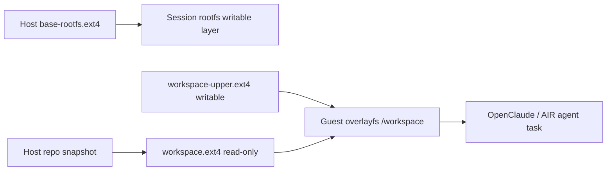

# 根文件系统管理架构

[English](rootfs-management-architecture.en.md)

本文定义 AIR 在 Firecracker 后端中的 rootfs、session 写层、workspace 镜像和 guest 内 overlayfs 管理方式。

## 1. 目标

根文件系统管理需要同时满足：

- 每个 VM session 的写入彼此隔离
- 基础运行时镜像可复用、可审计、可发布
- 工作目录可以从 host 注入到 guest
- guest 内修改不会污染 host 原始 repo 快照
- 任务结束后可以导出结果或销毁 session 状态

## 2. 当前状态

当前 Firecracker runtime 已经采用每 session 独立根盘文件：

- host 上有一个基础 `rootfs.ext4`
- session 启动时复制为 session 私有 `rootfs.ext4`
- 没有 workspace 时，session 根盘按可写 root drive 启动
- 有 workspace 时，session 根盘按只读 root drive 启动

当前方式的优点是实现简单、隔离清楚；缺点是复制完整 rootfs 会增加启动开销和磁盘占用。

## 3. 推荐目标架构

长期架构应拆成两条独立链路：

- rootfs 链路：负责 guest OS、AIR guest agent、OpenClaude/Bun 等运行时
- workspace 链路：负责用户项目 repo、任务输入和任务输出

推荐模型：



## 4. Rootfs 层

### 4.1 基础 rootfs

基础 rootfs 只承载稳定运行时资产：

- Linux userspace
- `/usr/bin/air-agent`
- OpenClaude 运行所需的 Bun 和基础依赖
- guest 启动脚本
- 诊断工具和最小 shell 环境

基础 rootfs 不应承载频繁变化的用户项目代码。

### 4.2 Session rootfs

每个 session 必须拥有独立可写根盘状态。

第一阶段继续沿用现有实现：

- 启动时复制基础 rootfs 为 session 私有 `rootfs.ext4`
- 无 workspace 时，`rootfs.ext4` 作为可写 root drive
- 有 workspace 时，`rootfs.ext4` 作为只读 root drive
- session 删除时删除 session 私有 `rootfs.ext4`

后续优化方向：

- 基础 rootfs 只读
- 每 session 独立块层写层
- 或引入 snapshot / reflink / thin-provisioning 降低复制成本

不推荐多个 VM 共享同一个可写 rootfs，因为 ext4 无法被多个 guest 安全并发写入。

## 5. Workspace 层

workspace 负责把 host repo 交给 guest 内的 agent 使用。

推荐第一版采用镜像挂载，而不是直接共享 host 目录：

- host 把 repo 快照构建成 `workspace.ext4`
- Firecracker 把 `workspace.ext4` 作为第二块盘传入 guest
- guest 只读挂载为 `/mnt/workspace-ro`
- guest 再挂载 session 私有 `workspace-upper.ext4`
- guest 使用 overlayfs 合并为 `/workspace`

## 6. Guest 内 overlayfs

guest 内挂载结构：

```text
/mnt/workspace-ro      read-only lowerdir, from workspace.ext4
/mnt/workspace-rw      writable upper disk, from workspace-upper.ext4
/mnt/workspace-rw/upper
/mnt/workspace-rw/work
/workspace             merged overlay view
```

挂载命令形态：

```sh
mount -o ro /dev/vdb /mnt/workspace-ro
mount /dev/vdc /mnt/workspace-rw
mkdir -p /mnt/workspace-rw/upper /mnt/workspace-rw/work /workspace
mount -t overlay overlay \
  -o lowerdir=/mnt/workspace-ro,upperdir=/mnt/workspace-rw/upper,workdir=/mnt/workspace-rw/work \
  /workspace
```

guest 对 `/workspace` 的修改只会落到 `workspace-upper.ext4`。

原因：

- `workspace.ext4` 以只读方式挂载
- overlayfs 修改已有文件时会 copy-up 到 upperdir
- 删除 lowerdir 文件时会在 upperdir 写 whiteout
- `workdir` 和 `upperdir` 在同一个可写文件系统上

## 7. Host 侧文件

每个 Firecracker session 推荐形成如下 host 侧目录：

```text
runtime/sessions/firecracker/<session-id>/
  rootfs.ext4
  workspace.ext4
  workspace-upper.ext4
  firecracker.sock
  firecracker.vsock
  console.log
  events.jsonl
  config/
    rootfs-drive.json
    workspace-drive.json
    workspace-upper-drive.json
```

其中：

- `rootfs.ext4` 是 session 私有根盘文件
- `workspace.ext4` 是 host repo 的只读快照
- `workspace-upper.ext4` 是 guest workspace 的 session 写层
- `config/*` 记录 Firecracker drive 配置，便于诊断和复现

## 8. 生命周期

### 8.1 创建 session

1. 解析 `--workspace` 或 session workspace 配置
2. 构建或复用基础 rootfs
3. 创建 session 根盘写层
4. 从 host repo 构建 `workspace.ext4`
5. 创建空的 `workspace-upper.ext4`
6. 启动 Firecracker 并传入 root drive、workspace lower drive、workspace upper drive
7. guest 启动脚本挂载 `/workspace`
8. guest `air-agent` 就绪后接受 exec / proxy 请求

### 8.2 运行任务

1. OpenClaude 或 AIR agent 在 `/workspace` 内工作
2. 读操作优先来自 `workspace.ext4`
3. 写操作进入 `workspace-upper.ext4`
4. 日志仍写入 session runtime 目录和 guest 内状态文件

### 8.3 导出结果

当前状态：

- `/workspace` 的 overlayfs 挂载已经在真实 Firecracker guest 中验证通过
- host 原 repo 在 guest 写入后保持不变
- `workspace-upper.ext4` 已承接 guest 写入
- 已支持 `air session export-workspace <id> <output-dir>` 导出当前 merged `/workspace` 视图

当前第一版实现：

- guest 内把 `/workspace` 打包
- 通过现有 exec/stdout 通道回传到 host
- host 解包到指定输出目录

后续可以优化为只导出 upperdir 差异。

### 8.4 删除 session

删除 session 时：

- 停止 Firecracker
- 保留或删除 session 私有 `rootfs.ext4`
- 保留或删除 `workspace-upper.ext4`
- 按用户选项保留导出的 workspace 结果

默认策略应偏向安全：不自动覆盖 host 原 repo。

## 9. Drive 设计

Firecracker 需要至少三类 block device：

- root drive：session 根盘，可写
- workspace lower drive：repo 快照，只读
- workspace upper drive：session workspace 写层，可写

初始实现可以固定设备顺序：

- `/dev/vda` root
- `/dev/vdb` workspace lower
- `/dev/vdc` workspace upper

更稳妥的后续实现应使用 label 或 UUID 挂载，避免设备名顺序变化带来风险。

## 10. 镜像构建策略

构建 `workspace.ext4` 时需要处理：

- 排除 `.git`、`.air`、大缓存目录
- 默认排除 `node_modules`，除非用户显式保留
- 保留符号链接、权限、可执行位
- 预估容量和 inode 数
- 记录源路径、构建时间、排除规则和内容摘要

`workspace-upper.ext4` 可以按固定初始大小创建，后续根据需要支持扩容。

## 11. 安全边界

该架构默认保证：

- guest 不能直接写 host repo
- guest 修改只进入 session 私有镜像
- 不同 session 的 rootfs 和 workspace 写层隔离
- host 可以在导出结果前审查变更

不保证：

- guest 内恶意进程无法消耗磁盘空间
- guest 内修改自动同步回 host
- workspace 镜像天然加密

这些能力需要通过 quota、结果审查、加密镜像或策略层继续补齐。

## 12. 实施顺序

推荐分阶段实现：

1. 支持 Firecracker 多 drive 配置
2. 支持 host repo 构建 `workspace.ext4`
3. 支持创建 `workspace-upper.ext4`
4. 在 guest 启动链挂载 overlayfs 到 `/workspace`
5. 让 OpenClaude 默认在 `/workspace` 工作
6. 支持导出 `/workspace` merged 结果
7. 支持 upperdir 差异导出和增量优化

第一版验收标准：

- `air session create --provider firecracker --workspace /path/to/repo` 能创建 VM
- guest 内存在 `/workspace`
- guest 修改 `/workspace` 后，host 原 repo 不变
- `workspace-upper.ext4` 中可观察到写入结果
- Firecracker guest 内 `/workspace` overlayfs 在真实环境中可用
- `air session export-workspace <id> <output-dir>` 能导出 merged workspace 结果

仍未完成：

- Firecracker guest 内真实 OpenClaude 任务验收
