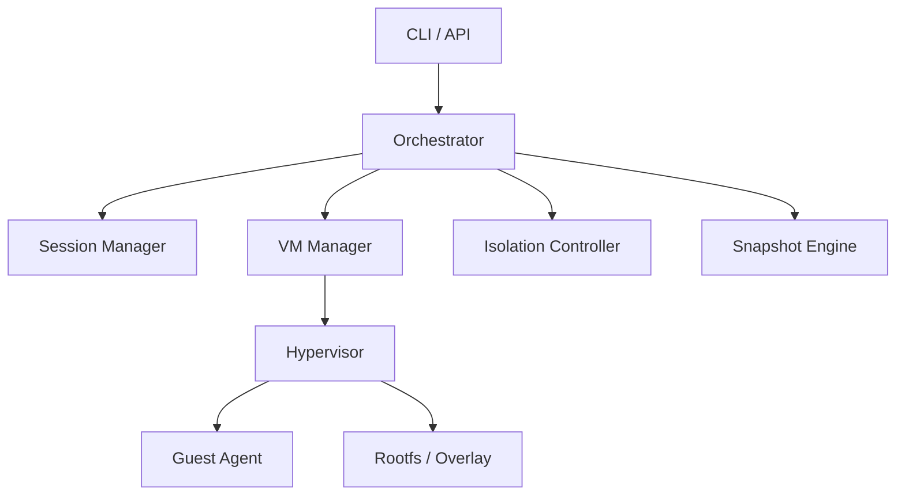
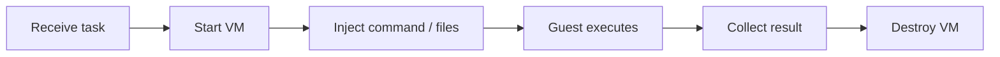
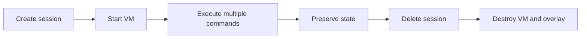
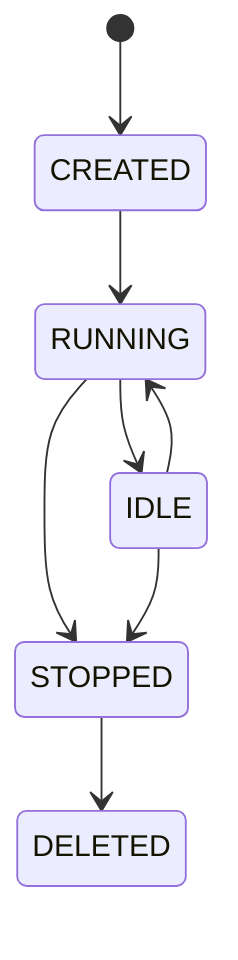

# AIR Technical Architecture

[中文](technical-architecture.md)

## 1. Goals

Provide a VM-based execution boundary for untrusted AI-generated code while supporting both one-shot execution and stateful sessions.

## 2. System View

## 3. Modules

- CLI / API: entry points for users and other systems
- Orchestrator: coordinates requests across runtime components
- Session Manager: owns lifecycle and session metadata
- VM Manager: starts, stops, and monitors VMs
- Guest Agent: receives exec requests inside the guest and returns structured results
- Isolation Controller: applies resource, timeout, and network policies
- Snapshot Engine: future optimization layer for restore and warm start

## 4. Execution Flows

### `run`

### `session`

## 5. State And Storage

AIR keeps runtime state, session metadata, and execution artifacts on the host so operators can inspect and recover runtime information.

## 6. Lifecycle Management

The architecture requires explicit state transitions for session creation, execution, idle time, stop, and deletion.

## 7. Security Design

Default deny networking, per-session isolation, bounded resources, and clear host/guest separation are foundational.

## 8. Technology Direction

Firecracker is the preferred hypervisor path, with guest communication moving toward `vsock` and storage evolving toward `base image + overlay`.

## 9. Future Evolution

Snapshot/restore, warm pools, richer observability, and stronger production automation remain downstream milestones.
