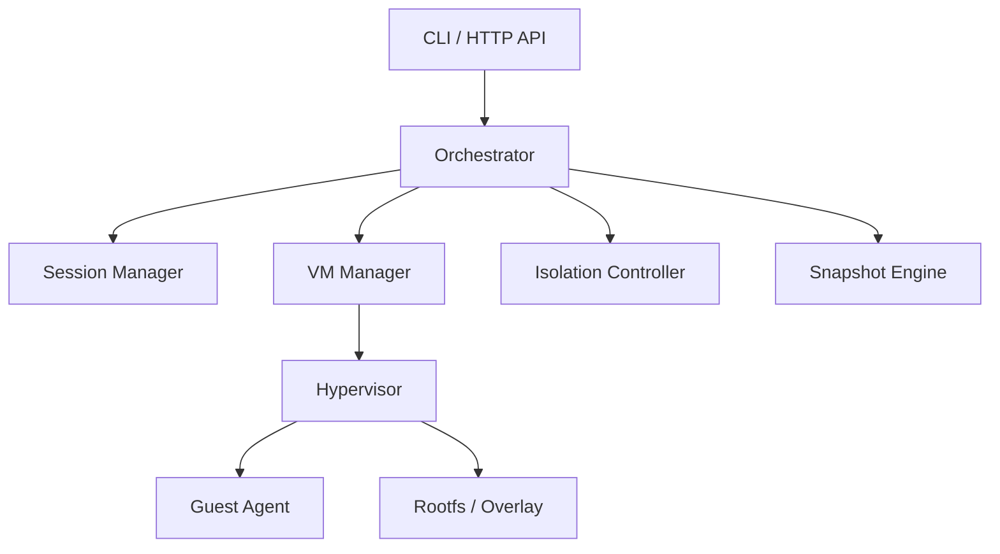
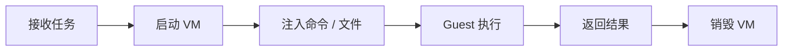
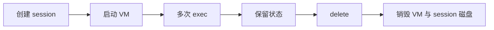
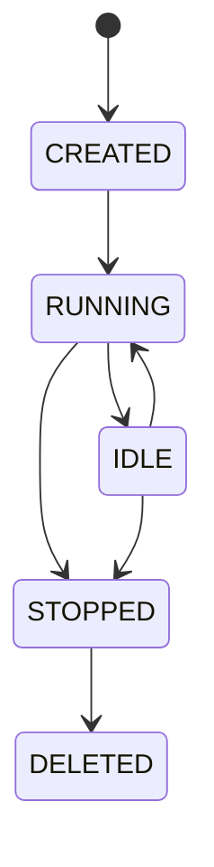

# AIR 技术架构

## 1. 架构目标

AIR 采用“控制面 + 执行面”分层设计。控制面负责创建、调度、回收与状态管理；执行面负责在隔离 VM 中实际运行代码。

## 2. 总体架构



## 3. 模块说明

### 3.1 CLI / API

对外提供统一入口。

接口示例：

- `air run`
- `air session create`
- `air session exec`
- `air session delete`
- `POST /session`
- `POST /session/{id}/exec`
- `DELETE /session/{id}`

### 3.2 Orchestrator

负责统一调度流程，包括 VM 分配、状态流转、资源回收与错误处理。

### 3.3 Session Manager

维护 session 元数据。

建议结构：

```go
type Session struct {
    ID        string
    VMID      string
    Status    string
    CreatedAt time.Time
    LastUsed  time.Time
}
```

职责：

- CreateSession
- Exec
- DeleteSession
- GC

### 3.4 VM Manager

封装底层虚拟化能力。

建议接口：

```go
StartVM(config) -> vmID
DestroyVM(vmID)
CopyToVM(vmID, src, dst)
CopyFromVM(vmID, src, dst)
```

### 3.5 Guest Agent

运行在 VM 内，负责接收命令、执行命令、回传结果。

演进路线：

- MVP：轮询 `/task/cmd.sh` 并写 `/task/result.txt`
- V1：改为 `virtio-vsock`

### 3.6 Isolation Controller

负责网络、资源和文件系统隔离。

策略：

- v0 默认不挂网络设备
- 每个 session 独立 overlay
- 增加 CPU、内存、超时限制

### 3.7 Snapshot Engine

负责预热、保存、恢复虚拟机状态。

建议路径：

- V1：`base image + overlay`
- V2：snapshot/restore + VM 池

## 4. 执行流程

### 4.1 Run 流程



### 4.2 Session 流程



## 5. 状态与存储

- MVP：本地 `sessions.json`
- V1：建议 SQLite
- V2：按部署模式升级到 Postgres

文件系统分层：

- 基础 `rootfs.ext4`：host 侧可复用基础镜像
- session `rootfs.ext4`：每个 session 私有根盘
- `workspace.ext4`：可选的 host repo 只读快照
- `workspace-upper.ext4`：可选的 guest workspace 写层

## 6. 生命周期管理

状态机：



GC 策略：

- 30 分钟未使用自动销毁
- Guest 不健康时强制回收

## 7. 安全设计

- 默认无网络
- 不共享宿主业务环境
- 每次任务/会话独立 VM
- 限制执行时长与资源
- 命令返回包含 stdout/stderr/exit_code

## 8. 技术选型建议

- 控制面：Go
- Hypervisor：主方案采用 Firecracker（基于 KVM），QEMU/KVM 作为调试或兼容兜底
- Guest：最小 rootfs，优先 Ubuntu 或 Yocto 镜像
- 通信：主方案采用 `virtio-vsock`，MVP 文件通信仅用于本地链路验证

更多细节见：

- [虚拟化技术选型](virtualization-selection.md)
- [VM Runtime 设计](vm-runtime-design.md)

## 9. 后续演进

- 流式输出
- 快速恢复
- 白名单网络
- 多租户与权限体系
- 分布式调度与资源池
