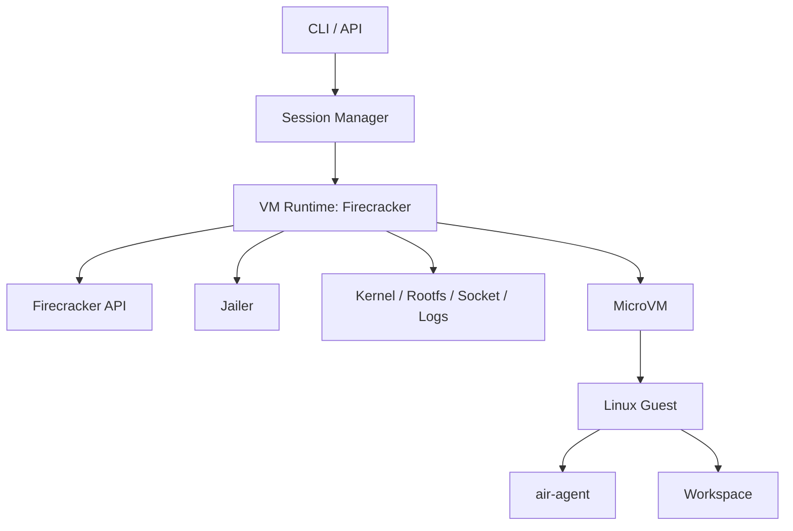
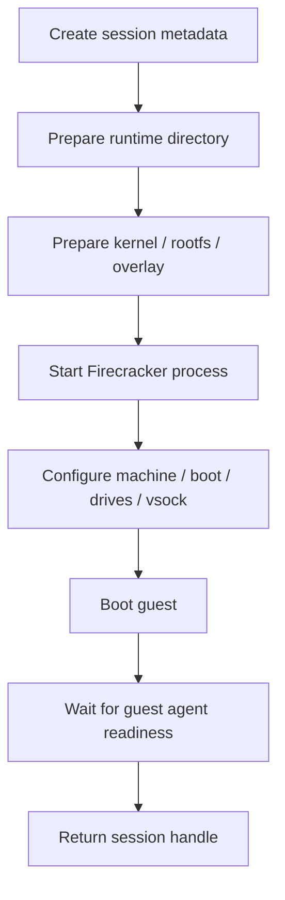
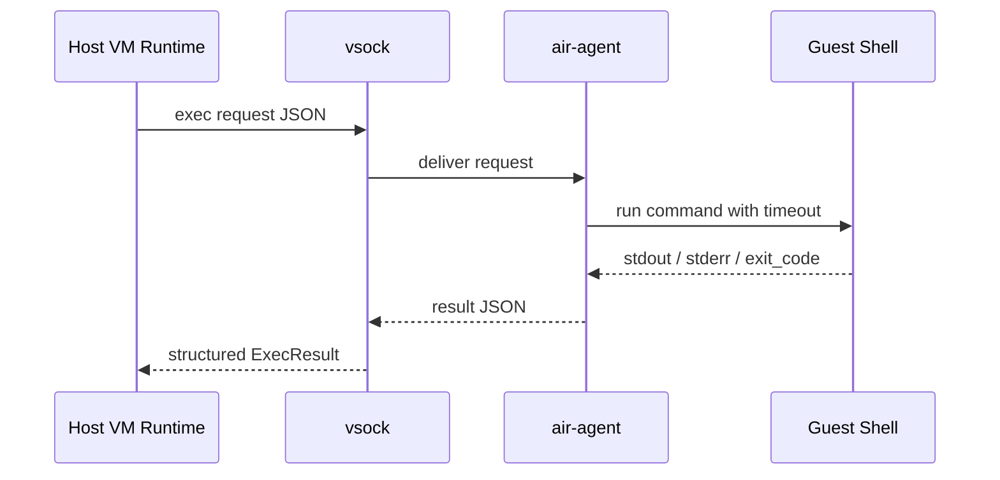
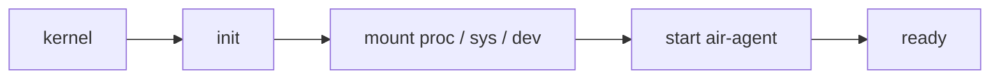

# AIR VM Runtime Design (Firecracker)

[中文](vm-runtime-design.md)

## 1. Goal

Describe the Firecracker-based runtime design used to create isolated AIR sessions.

## 2. Architecture

The host control plane manages session lifecycle, prepares runtime artifacts, starts Firecracker, and communicates with an in-guest agent over `vsock`.

## 3. Components

- Session Manager
- VM Runtime
- Guest Agent

## 4. Host Runtime Directory

Each session should own its own runtime directory, including config, sockets, logs, metrics, and writable disk state.

## 5. Boot Flow

## 6. Guest Communication

`vsock` is the preferred transport because it cleanly matches host/guest boundaries and avoids ad-hoc polling.

## 7. Rootfs Design

Use a stable base rootfs and derive a writable per-session disk. This keeps sessions isolated while preserving startup simplicity.

## 8. Guest Startup Chain

The guest should boot directly into the minimal service path required to bring up `air-agent`.

## 9. Go Control Plane Integration

The Go side should expose stable create, exec, inspect, and delete behavior and normalize runtime errors for agent consumers.

## 10. Security

Default no-network behavior, process isolation, and bounded resources remain core controls.

## 11. Failure Handling

Handle boot failures, guest-agent readiness failures, and exec failures as separate classes.

## 12. Implementation Order

Start from boot and transport, then integrate guest agent, writable rootfs, lifecycle tooling, and error handling.

## 13. Current Replacement Strategy

The design already replaces mock execution with real Firecracker plus real guest-agent communication where available.

## 14. Conclusion

The Firecracker path is now the concrete runtime direction for AIR.
