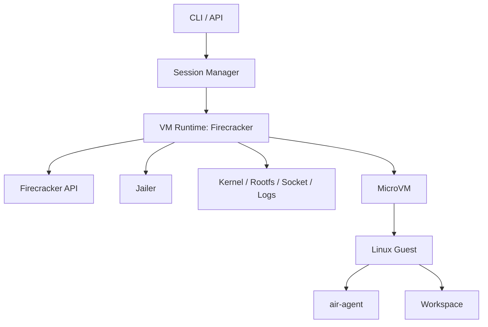
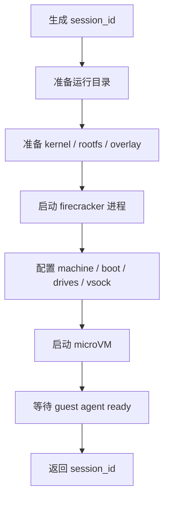
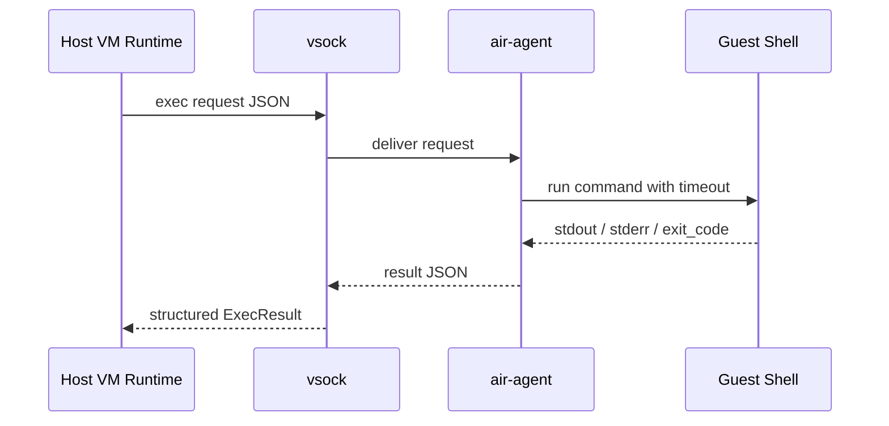
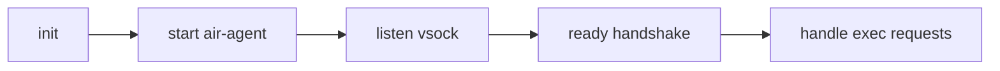
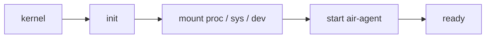

# AIR VM Runtime 设计文档（Firecracker 方案）

## 1. 目标

本设计文档定义 AIR 如何将当前 `internal/vm` 的本地执行适配器替换为真正的 VM Runtime。

设计目标：

- 每个 session 启动一个 Firecracker microVM
- Guest 内运行 `air-agent`
- Host 通过 `vsock` 与 guest 通信
- `exec` 请求在 guest 内执行并返回结果
- 为后续 snapshot、预热池和资源隔离留出结构

## 2. 总体架构



## 3. 组件划分

### 3.1 Session Manager

职责：

- 创建 session
- 保存 session 与 VM 元数据
- 调用 VM Runtime 启停 microVM
- 发起 `exec`

### 3.2 VM Runtime

职责：

- 准备 Firecracker 工作目录
- 生成 socket、日志、metrics、kernel、rootfs 配置
- 调用 Firecracker API 启动 microVM
- 管理 `vsock` 通道
- 停止并清理 microVM

建议结构：

```text
internal/vm/
  runtime.go
  firecracker.go
  vsock.go
  config.go
```

### 3.3 Guest Agent

职责：

- 在 guest 启动时自动运行
- 监听 `vsock`
- 接收命令执行请求
- 返回 `stdout/stderr/exit_code`

建议 guest 内固定路径：

```text
/usr/bin/air-agent
```

## 4. Host 侧运行目录

建议每个 session 维护一个独立运行目录：

```text
runtime/firecracker/<session_id>/
  firecracker.sock
  console.log
  metrics.log
  kernel/
  rootfs/
  config/
```

说明：

- `firecracker.sock`：Host 与 Firecracker API 通信
- `console.log`：Guest 串口日志
- `metrics.log`：Firecracker metrics

## 5. 启动流程

### 5.1 Create Session

流程：



### 5.2 Firecracker 配置要点

- vCPU：默认 1
- Memory：默认 256 MiB 或 512 MiB
- Kernel：固定构建产物
- Rootfs：文件后端 block device
- Network：默认不配网卡
- Vsock：每 VM 一个唯一 CID
- Console：打开串口输出便于调试

## 6. Guest 通信设计

## 6.1 为什么选 `vsock`

原因：

- Host/Guest 天然通信机制
- 不依赖 TCP/IP 网络
- 适合默认无网络模式
- 比文件轮询更快、更清晰

## 6.2 通信模型



Host 发请求：

```json
{
  "type": "exec",
  "request_id": "req_001",
  "command": "ls -al",
  "timeout_sec": 5
}
```

Guest 返回结果：

```json
{
  "type": "result",
  "request_id": "req_001",
  "stdout": "file.txt\n",
  "stderr": "",
  "exit_code": 0
}
```

## 6.3 Guest Agent 生命周期

Guest 启动后：



必要能力：

- 单连接或连接池监听
- 命令超时
- stdout/stderr 捕获
- 异常恢复

## 7. Rootfs 设计

### 7.1 当前建议

- 一个固定基础 rootfs
- guest 内包含：
  - `sh`
  - `coreutils`
  - `air-agent`

### 7.2 后续建议

- 只读基础镜像
- 每个 session 独立写层
- snapshot 前统一收敛状态

## 8. Guest 启动方式

推荐 guest 启动链：



最小 `init` 需要完成：

- 挂载 `/proc`
- 挂载 `/sys`
- 挂载必要文件系统
- 启动 `air-agent`
- 输出 ready 日志

## 9. Go 控制面接入建议

推荐优先使用：

```text
firecracker-go-sdk
```

原因：

- 比手写 REST 更稳
- 结构清晰
- 方便管理 machine config、drives、vsock、进程生命周期

本项目中的建议封装：

```go
type Runtime interface {
    Start(sessionID string) (vmID string, err error)
    Exec(sessionID string, command string, timeout time.Duration) (*ExecResult, error)
    Stop(vmID string) error
}
```

Firecracker 实现负责：

- 创建 API socket
- 启动 firecracker 进程
- 配置 machine
- 等待 guest ready
- 通过 vsock 发命令

## 10. 安全设计

### 10.1 默认无网络

Phase 1 / Phase 2 默认不挂 `virtio-net`。

### 10.2 进程隔离

生产环境使用 `jailer`。

### 10.3 资源限制

初始支持：

- vCPU 数
- 内存
- exec timeout

后续增加：

- I/O 限流
- snapshot 配额

## 11. 失败处理

### 11.1 启动失败

- 记录 Firecracker 控制台日志
- 标记 session 为 error
- 清理运行目录

### 11.2 Guest Agent 未就绪

- 设置启动等待超时
- 超时后销毁 microVM

### 11.3 Exec 失败

- 区分：
  - agent 不可达
  - 命令失败
  - 命令超时

## 12. 实现顺序

### Step 1

接入 Firecracker，能启动和销毁最小 guest。

### Step 2

在 guest 内运行 `air-agent`，用串口日志确认 ready。

### Step 3

接入 `vsock`，完成 `exec` 请求闭环。

### Step 4

让 `session create / exec / delete` 切换到真实 Firecracker Runtime。

### Step 5

加入 overlay、snapshot、预热池。

## 13. 当前替换策略

当前仓库的 `internal/vm` 还是本地命令执行适配器，只用于验证 session 模型。后续替换策略如下：

```text
local runtime adapter -> firecracker runtime adapter
```

也就是说：

- 对上层 `session.Manager` 保持接口不变
- 对底层 `vm.Runtime` 替换实现

这样可以把迁移影响控制在 `internal/vm` 内部。

## 14. 结论

AIR 的 VM Runtime 主方案采用：

```text
Firecracker + firecracker-go-sdk + virtio-vsock + guest air-agent + jailer
```

这是当前最符合 AIR 目标的组合：足够轻、足够安全、足够适合 Agent Session 模型，并且保留了后续 snapshot 和快速恢复的演进空间。
